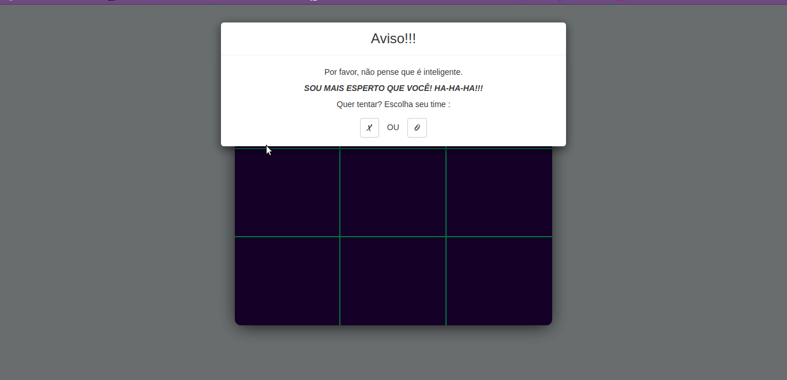
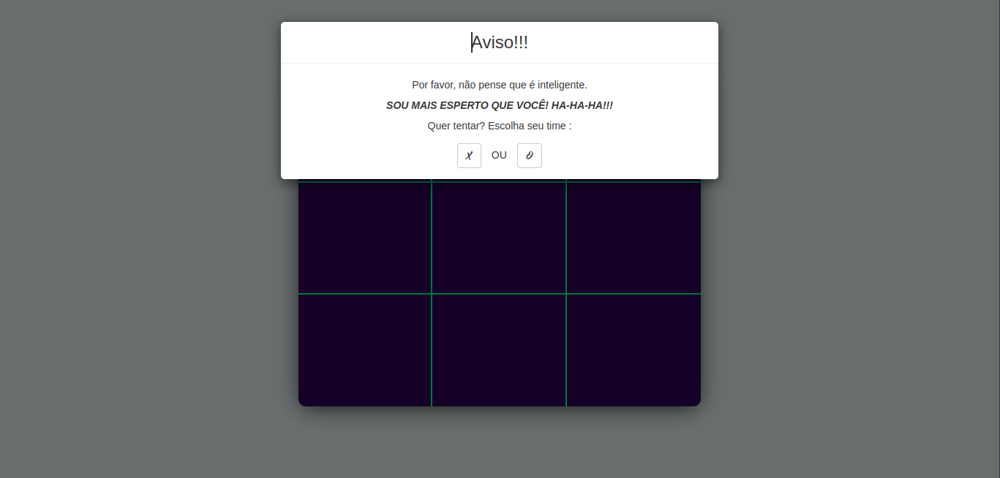

<h1 align="center">
  Cerquilha
</h1>
O famoso "Jogo da Velha" é um jogo de regras extremamente simples, que não traz grandes dificuldades para seus jogadores e é facilmente aprendido. A origem é desconhecida, com indicações de que pode ter começado no antigo Egito, onde foram encontrados tabuleiros esculpidos na rocha, que teriam mais de 3.500 anos.
  

  
  

## 🚀 Tecnologias

<ul>
  <li>HTML5</li>
  <li>CSS3</li>
  <li>Javascript</li>
</ul>
